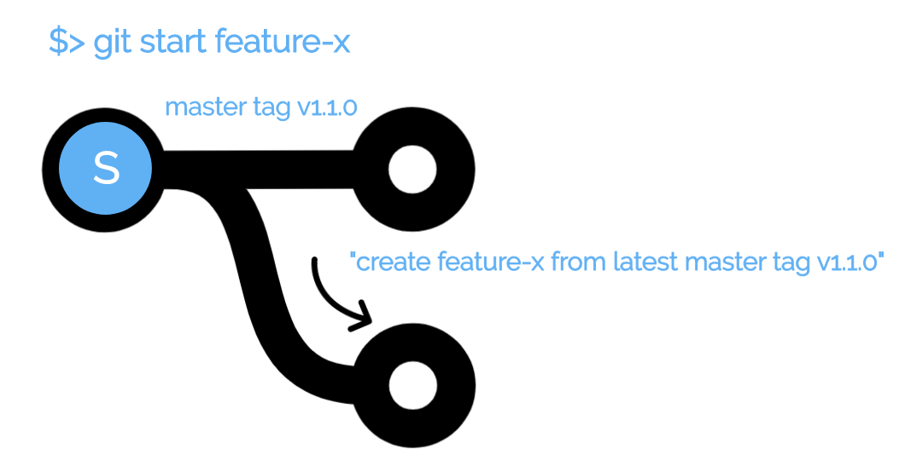
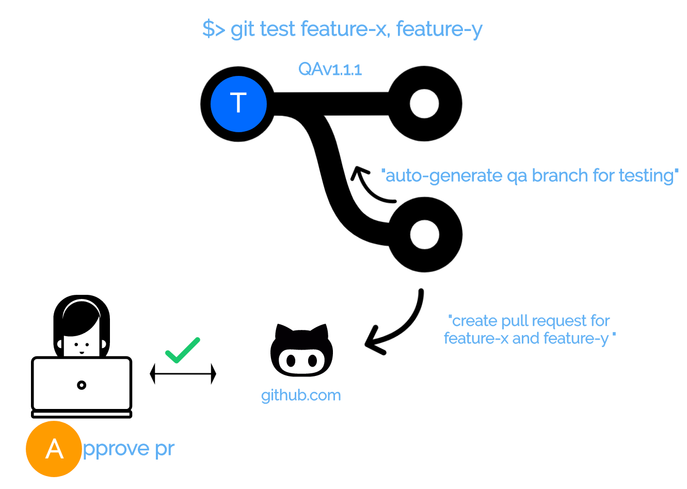
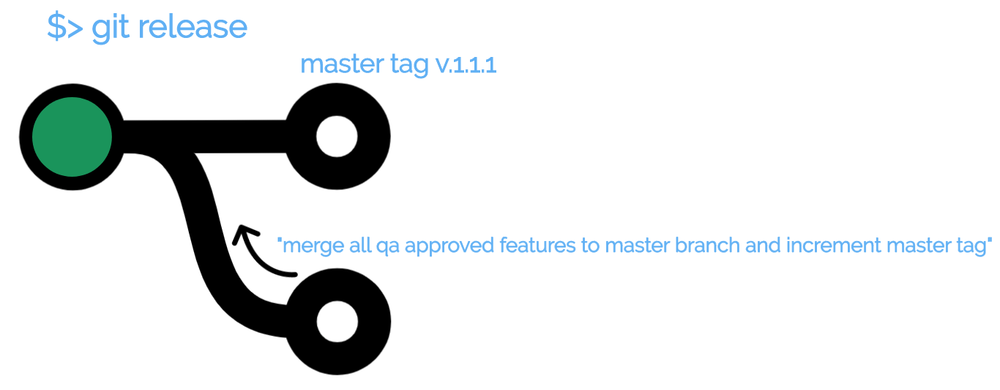

<h3>Git Star : A simple and powerful git workflow alternative</h3>
<table>
<tr>
	<td>
	
	</td>
	<td>
		<b>Why Use Git Star to manage your git development process?</b>
		

		<ol>
			<li>Supports Hotfixes (coming soon)
			<li>No more cherry picking features into or out of master
			<li>Custom acceptance branches via --include or --exclude params
			<li>Auto magically manages separate QA and Acceptance branches
			<li>Auto magically Generates PRs for all features branches (can override)
			<li>New releases are automatically tagged and incremented
			<li>Auto generated release notes as part of the release process
			<li>View features in any branch using the git explain command (soon)
			<li>Easy to connect to any CI/CD process
		</ol>
	</td>
</tr>
</table>
<h3>To Install</h3>
<code>$>brew install git-star</code>

<h3>Typical Workflow</h3>

<pre><code>
	$><b>git start</b> my-cool-feature
		do normal edits ... 
		git add .
		git commit -m "My Descriptive Message"
		git push
	$><b>git test</b> my-cool-feature
		Branch QAv1.0 successfully created
		PR opened for QAv1.0 <- my-cool-feature
		PR URL is https://github.com/youraccount/your-repo/pull/1
		Run git staging after PR is approved and merged
	$><b>git acceptance</b>
		All approved PRs from latest QA branch will be merged to Staging
		Run git release after Product Owner approves features for release
	$><b>git release</b>
		Releasing version v1.2.0 from staging to Production (master)
		709f414 Merge branch 'staging' into master
		e035e94 Merge branch 'some-cool-feature' into staging
		67846d2 Some very descriptive comment about this feature
		Successfully released changes of v1.2.0 from staging to master 
</code>
</pre>

<h1>Command Documentation</h1>
<table>
	<tr>
		<td colspan="3" align="left"><h2>git start [name]</h2></td>
	</tr>
	<tr>
		<td colspan="3">
			<li>Creates a new branch from master with the specified name and latest release tag.
			<li>Autogenerate a base release tag if not found on initial creation
		</td>
	</tr>
	<tr align="center">
		<td>Argument</td>
		<td>Usage</td>
		<td>Description</td>
	</tr>
	<tr>
		<td align="center">name of the feature</td>
		<td align="center">git start my-feature</td>
		<td>creates or checks out the "my-feature" branch for editing</td>
	</tr>
	<tr>
		<td colspan="3">
			
		</td>
	</tr>
	<tr>
		<td colspan="3">
			
&nbsp;

			
&nbsp;

			<!-- acceptance image goes here //-->
		</td>
	</tr>		
	<tr>
		<td colspan="3" align="left"><h2>git test [ name | comma separated list ] (--no-pull-request)</h2></td>
	</tr>
	<tr>
		<td colspan="3">
			<li>Creates PR for the specified feature
			<li>Autoincrement a new QA branch or reuse current QA branch if it still has open PRs 
			<li>Return the PR URL
		</td>
	</tr>
	<tr align="center">
		<td>Argument</td>
		<td>Usage</td>
		<td>Description</td>
	</tr>
	<tr>
		<td>name</td>
		<td>git test my-cool-feature</td>
		<td>generates PR for my-cool-feature and optionally a new QA branch</td>
	</tr>
	<tr>
		<td>comma separated list</td>
		<td>git test my-featureA,my-featureB</td>
		<td>generates PRs for both features and optionally a new QA branch</td>
	</tr>
	<tr>
		<td>--no-pull-request</td>
		<td>git test featureC --no-pull-request</td>
		<td>Automatically approve and merge the PR for the feature into the appropriate QA branch</td>
	</tr>
	<tr>
		<td colspan="3">
			
		</td>
	</tr>
	<tr>
		<td colspan="3">
			
&nbsp;

			
&nbsp;

			<!-- acceptance image goes here //-->
		</td>
	</tr>	
	<!-- Acceptance //-->
	<tr>
		<td colspan="3" align="left"><h2>git acceptance (--include=[feature list] | --exclude=[feature list])</h2></td>
	</tr>
	<tr>
		<td colspan="3">
			<li>Builds new staging branch from lastest production release
			<li>Merges all approved features since last production release into the staging branch (default)
			<li>Using the include or exclude flag allows the user to specify exactly which features appear in the staging branch
		</td>
	</tr>
	<tr align="center">
		<td>Argument</td>
		<td>Usage</td>
		<td>Description</td>
	</tr>
	<tr>
		<td>--include</td>
		<td>git acceptance --include=my-cool-feature,my-feature-y</td>
		<td>Only move my-cool-feature and my-feature-y to staging branch, ignore all others</td>
	</tr>
	<tr>
		<td>--exclude</td>
		<td>git acceptance --exclude=my-cool-feature,my-feature-y</td>
		<td>Move all features to staging branch except my-cool-feature and my-feature-y</td>
	</tr>
	<tr>
		<td colspan="3">
			
&nbsp;

			
&nbsp;

			<!-- acceptance image goes here //-->
		</td>
	</tr>
	<!-- Acceptance //-->
	<tr>
		<td colspan="3" align="left"><h2>git release</h2></td>
	</tr>
	<tr>
		<td colspan="3">
			<li>Merge staging branch into master (production)
			<li>Auto increment master Tag
			<li>Generate and display release notes of all changes since last production release
		</td>
	</tr>
	<tr align="center">
		<td>Argument</td>
		<td>Usage</td>
		<td>Description</td>
	</tr>
	<tr>
		<td align="center">(none)</td>
		<td align="center">git release</td>
		<td>create a new release from staging and tag it</td>
	</tr>
	<tr>
		<td colspan="3">
			
		</td>
	</tr>	
</table>
<!--
<ul>
	<li type="none">		
			<ul>
				<li type="none"><b>(S)</b>tart a feature
					<ul>
						<li type="none">
						</li>
					</ul>
				</li>
				<li type="none">(T)</b>est the feature on a combined test branch after <b>(A)</b>pproving the pull request (optional)
					<ul>
						<li type="none">
						</li>
					</ul>
				</li>
				<li type="none">(R)</b>elease the set of features to the production branch
					<ul>
						<li type="none">
						</li>
					</ul>
				</li>			
	</li>
</ul>
//-->
