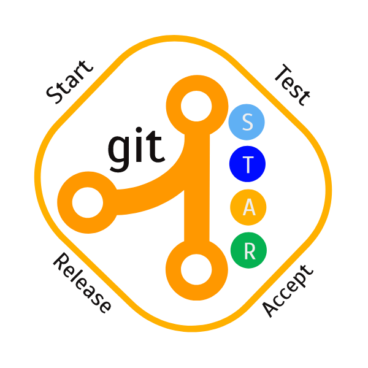

A set of drop-dead simple commands to:
* (S)tart a feature 
  * Ex: "git start feature-abc1234"
* (T)est the feature on a combined branch 
  * Ex: "git test feature-1, hotfix-one"
* (A)sk other developers to review the generated pull request
  * note: the request is generated automatically
* (R)elease the set of features to the master branch 
  * Ex: "git release"

* Excellent guide on how to setup your own homebrew install
	* https://tech.cars.com/distributing-your-home-grown-tools-to-the-masses-with-homebrew-acb7a62518a8

