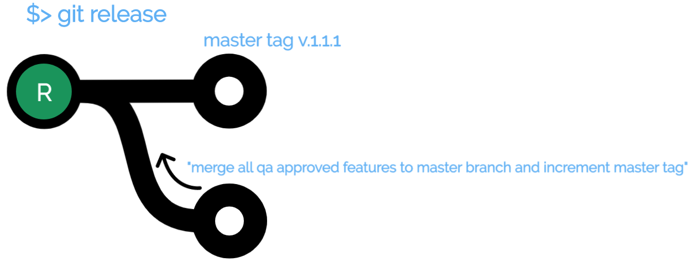

<h3>Git Star : A simple and powerful git workflow alternative</h3>

<h3>To Install</h3>
<code>$>brew install git-star</code>

Git Star adds a few powerful commands to your standard git install:
<ul>
	<li type="none"><h1><ul><b>(S)</b>tart a feature </h1>
		<h3>git start [your-feature] - create new feature or continue working on a feature. This feature will be based off the latest production release (tag)</h3>
		<code>$> git start some-feature
			*************************** DEBUG MSGS FOR THIS RELEASE ***************

			Current Release Number is v1.1.9
  			some-feature already exists..performing git checkout
			Working on branch some-feature
			Your branch is up to date with 'origin/some-feature'.
			*******************************
		</code>
		<li type="none"></ul>
	<li type="none"><h1><ul><b>(T)</b>est the feature on a combined test branch after <b>(A)</b>pproving the pull request (optional)</h1>
		<li type="none"></ul>
	<li><h1><ul><b>(R)</b>elease the set of features to the production branch</h1>
		<li type="none"></ul>	
</ul>
